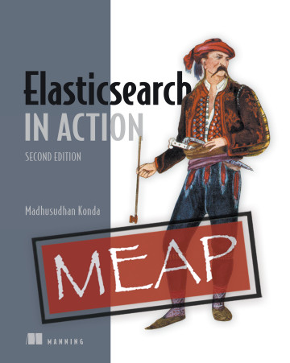

# 《Elasticsearch in Action, Second Edition》Learning Notes


## 1. Profiles



|    **Title**    | **Elasticsearch in Action, Second Edition** [ISBN: 9781617299858] |
| :-------------: | :----------------------------------------------------------: |
|   **Author**    |                    **Madhusudhan Konda**                     |
| **Publication** |  **Manning,   MEAP began 2021.8; Spring 2023 (estimated)**   |
|    **Pages**    |                           **475**                            |

> **Introduction**
>
> **Build powerful, production-ready search applications using the incredible features of Elasticsearch.**
>
> In *ElasticSearch in Action, Second Edition* you will discover:
>
> - Architecture, concepts, and fundamentals of Elasticsearch
> - Installing, configuring and running Elasticsearch and Kibana
> - Creating an index with custom settings
> - Data types, mapping fundamentals, and templates
> - Fundamentals of text analysis and working with text analyzers
> - Indexing, deleting, and updating documents
> - Indexing data in bulk and reindexing and aliasing operations
> - Learning search concepts, relevancy scores and similarity algorithms
>
> 
> *Elasticsearch in Action, Second Edition* teaches you to build scalable search applications using Elasticsearch. This completely new edition explores Elasticsearch fundamentals from the ground up. You’ll deep dive into design principles, search architectures, and Elasticsearch’s essential APIs. Every chapter is clearly illustrated with diagrams and hands-on examples. You’ll even explore real-world use cases for full text search, data visualisations, and machine-learning.
>
> ## about the technology
>
> Modern search seems like magic. You type a few words and the search engine appears to know what you want. With the Elasticsearch near-real-time search and analytics engine, you can give your users this magical experience without having to do complex low-level programming or understand advanced data science algorithms. You just install it, tweak it, and get on with your work.
>
> ## about the book
>
> *Elasticsearch in Action, Second Edition* is a hands-on guide to developing fully functional search engines with Elasticsearch and Kibana. Rewritten for the latest version of Elasticsearch, this completely new second edition explores Elasticsearch’s high-level architecture, reveals infrastructure patterns, and walks through the search and analytics capabilities of numerous Elasticsearch APIs.
>
> It covers dozens of awesome techniques, such as:
>
> 
>
> - Developing a multitude of search queries
> - Working with various query types
> - Enabling search results with sorting and pagination functionality
> - Writing and working with advanced search queries
> - Working analytics and aggregations
> - Developing high level visualizations in Kibana
> - Configuring and scaling the clusters, and tuning performance
>
>
> You’ll quickly progress from the basics of installation and configuring clusters, to indexing documents, advanced aggregations, and putting your servers into production. By the time you’re done, you’ll be ready to build amazing search engines for your clients that take advantage of Elasticsearch’s modern features.


## 2. Outlines

Status available：:heavy_check_mark: (Completed) | :hourglass_flowing_sand: (Working) | :no_entry: (Not Started) | :orange_book: (Finish reading)

| No.  |        Chapter Title        |          Status          |
| :--: | :-------------------------: | :----------------------: |
| Ch01 | [Overview](./Ch01.md) | :orange_book: |
| Ch02 | [Getting started](./Ch02.md) | :orange_book: |
| Ch03 | [Architecture](./Ch03.md) | :orange_book: |
| Ch04 | [Mapping](./Ch04.md) | :orange_book: |
| Ch05 | [Working with documents](./Ch05.md) | :hourglass_flowing_sand: |
| Ch06 | [Indexing operations](./Ch06.md) | :no_entry: |
| Ch07 | [Text analysis](./Ch07.md) | :no_entry: |
| Ch08 | [Introducing search](./Ch08.md) | :no_entry: |
| Ch09 | [Term-level search](./Ch09.md) | :no_entry: |
| Ch10 | [Full-text search](./Ch10.md) | :no_entry: |
| Ch11 | [Compound queries](./Ch11.md) | :no_entry: |
| Ch12 | [Advanced search](./Ch12.md) | :no_entry: |
| Ch13 | [Aggregations](./Ch13.md) | :no_entry: |
| Ch14 | [Administration](./Ch14.md) | :no_entry: |


Powershell script for generating markdown files in batch:

```powershell
# Create 14 empty markdown files named Ch##.md:
for($i=1; $i -le 14; $i=$i+1){ New-Item -Name "Ch$('{0:d2}' -f $i).md"; }
```

 
